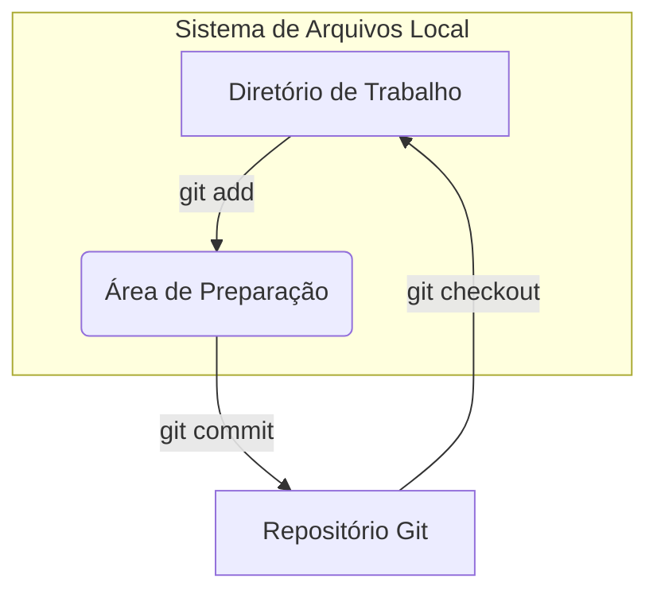

# Guia Completo: Comandos Iniciais do Git - Os Três Estados
---

Para começar a usar o **Git** de forma eficaz, é crucial entender seus conceitos fundamentais, especialmente os "três estados" em que um arquivo pode se encontrar. Essa compreensão é a base para o fluxo de trabalho do Git e para o uso dos comandos iniciais mais importantes.

## Os Três Estados do Git
---

O Git gerencia seus arquivos em três estados principais, que representam diferentes estágios no ciclo de vida das suas alterações:

1.  **Diretório de Trabalho (Working Directory/Working Tree):**
    * Este é o local físico em seu sistema de arquivos onde você vê e edita seus arquivos. É a sua "área de rascunho".
    * Quando você clona um repositório, ele é descompactado no seu diretório de trabalho.
    * Quando você cria um novo arquivo ou modifica um existente, ele está neste estado.
    * O Git sabe que o arquivo existe e que ele foi modificado, mas ainda não está pronto para ser "comitado".

2.  **Área de Preparação (Staging Area/Index):**
    * Também conhecida como "Index", esta é uma área intermediária onde você "prepara" as alterações que deseja incluir no seu próximo commit. Pense nela como uma "lista de espera" para o commit.
    * Você usa o comando `git add` para mover arquivos (ou partes de arquivos) do Diretório de Trabalho para a Área de Preparação.
    * Ao usar a Área de Preparação, você tem controle granular sobre quais modificações serão incluídas no próximo commit. Isso permite que você faça commits lógicos e organizados, mesmo que tenha feito várias alterações em diferentes arquivos.

3.  **Repositório Git (Git Directory/.git Directory):**
    * Este é o banco de dados do Git onde todas as versões do seu projeto são armazenadas de forma permanente. Ele contém todo o histórico do projeto, incluindo todos os commits.
    * Quando você executa o comando `git commit`, as alterações da Área de Preparação são salvas como um novo "instantâneo" (snapshot) no repositório.
    * Cada commit é um ponto seguro no tempo para o qual você pode reverter se necessário.



## Comandos Iniciais Essenciais
---

Compreender os três estados é fundamental para usar os comandos básicos do Git: `git init`, `git add` e `git commit`.

### 1. `git init` - Inicializar um Repositório

Este comando é usado para criar um novo repositório Git em um diretório existente ou para converter um diretório não versionado em um repositório Git. Ele cria a subpasta `.git/` oculta, que é onde o Git armazena todo o histórico e as configurações do repositório.

**Uso:**

1.  **Navegue até o diretório do seu projeto no terminal:**
    ```bash
    cd /caminho/para/meu_projeto
    ```
2.  **Inicialize o repositório Git:**
    ```bash
    git init
    ```
    Você verá uma mensagem como: `Initialized empty Git repository in /caminho/para/meu_projeto/.git/`

### 2. `git add` - Adicionar Arquivos à Área de Preparação

Este comando move as alterações (novos arquivos ou modificações em arquivos existentes) do Diretório de Trabalho para a Área de Preparação. Ele "marca" essas alterações para serem incluídas no próximo commit.

**Uso:**

* **Adicionar um arquivo específico:**
    ```bash
    git add meu_arquivo.txt
    ```

* **Adicionar múltiplos arquivos específicos:**
    ```bash
    git add arquivo1.html arquivo2.css
    ```

* **Adicionar todos os arquivos modificados e novos no diretório atual:**
    ```bash
    git add .
    ```

* **Adicionar todos os arquivos modificados e novos no projeto (a partir da raiz do repositório):**
    ```bash
    git add -A
    ```
    * `-A` (ou `--all`): Inclui arquivos novos, modificados e excluídos.

### 3. `git commit` - Salvar Alterações no Repositório

Este comando pega todas as alterações que estão na Área de Preparação e as salva permanentemente no repositório Git como um novo commit. Cada commit é um "instantâneo" do seu projeto em um determinado momento e deve ter uma mensagem descritiva.

**Uso:**

* **Comitar com uma mensagem de uma linha:**
    ```bash
    git commit -m "Mensagem descritiva do meu commit"
    # Exemplo: git commit -m "Adiciona a página inicial do site"
    ```
    * `-m`: Usado para fornecer a mensagem do commit diretamente na linha de comando.

* **Comitar com uma mensagem mais longa (abre um editor de texto):**
    ```bash
    git commit
    ```
    Isso abrirá o seu editor de texto padrão (ex: `nano`, `vim`) para que você escreva uma mensagem de commit mais detalhada. A primeira linha deve ser um resumo conciso, seguida por uma linha em branco e depois por detalhes adicionais.

### 4. `git status` - Verificar o Status do Repositório

Embora não altere o estado dos arquivos, o comando `git status` é essencial para entender onde seus arquivos se encontram no fluxo de trabalho do Git. Ele mostra:

* Quais arquivos foram modificados no Diretório de Trabalho.
* Quais arquivos foram adicionados à Área de Preparação.
* Quais arquivos não estão sendo rastreados pelo Git.

**Uso:**

```bash
git status
```

**Exemplo de fluxo de trabalho:**

```bash
# 1. Crie um novo diretório e inicialize o Git
mkdir meu_projeto_git
cd meu_projeto_git
git init

# 2. Crie um novo arquivo no Diretório de Trabalho
echo "Conteúdo do meu primeiro arquivo." > readme.txt

# 3. Verifique o status (readme.txt está não rastreado)
git status
# Saída: Untracked files: readme.txt

# 4. Adicione o arquivo à Área de Preparação
git add readme.txt

# 5. Verifique o status novamente (readme.txt está pronto para commit)
git status
# Saída: Changes to be committed: new file: readme.txt

# 6. Faça o commit para o Repositório Git
git commit -m "Adiciona o arquivo inicial README"

# 7. Verifique o status (diretório de trabalho limpo)
git status
# Saída: nothing to commit, working tree clean

# 8. Modifique o arquivo
echo "Nova linha adicionada." >> readme.txt

# 9. Verifique o status (readme.txt está modificado)
git status
# Saída: Changes not staged for commit: modified: readme.txt

# 10. Adicione as mudanças à Área de Preparação
git add readme.txt

# 11. Faça um novo commit
git commit -m "Atualiza README com nova informação"
```

## Conclusão
---

Entender os três estados do Git (Diretório de Trabalho, Área de Preparação e Repositório) e como os comandos `git init`, `git add` e `git commit` interagem com eles é o ponto de partida para qualquer usuário de Git. Essa base sólida permitirá que você rastreie suas alterações de forma eficaz e construa um histórico de projeto claro e organizado.
